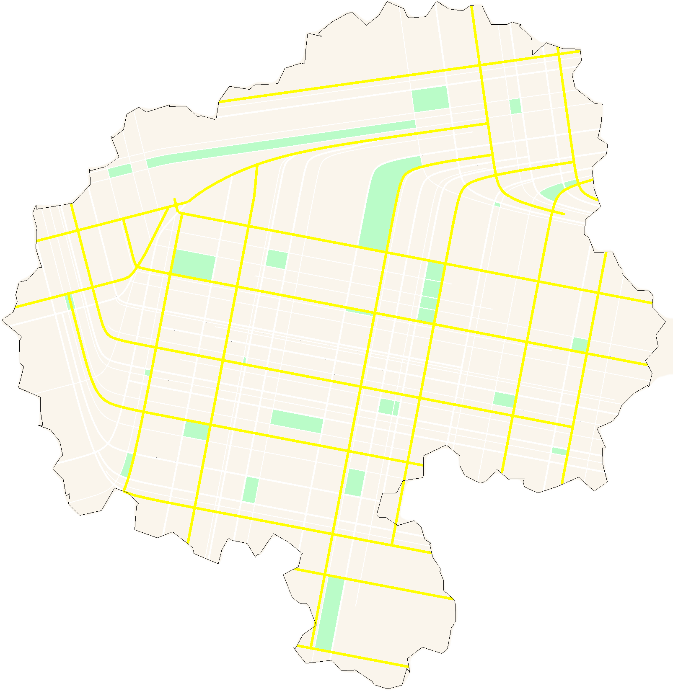
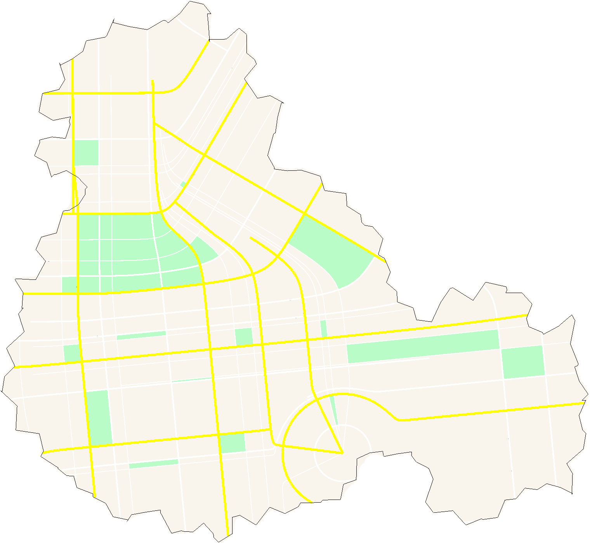
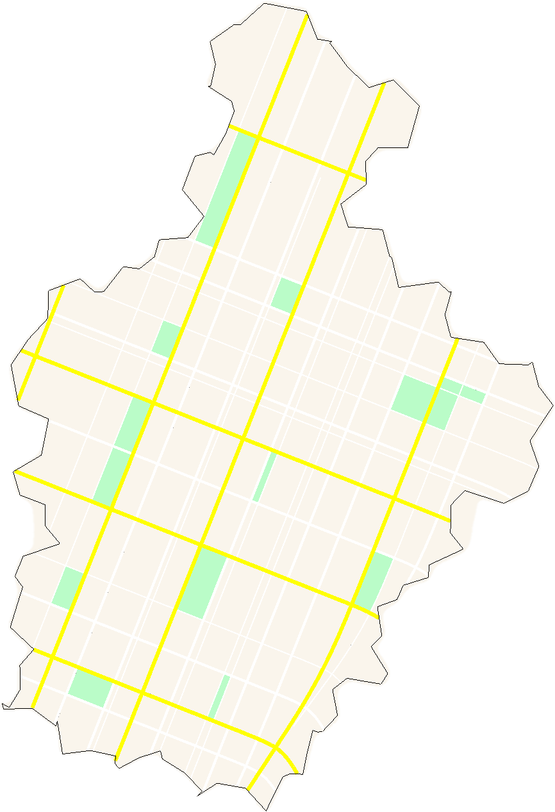

<h1>  CityGen</h1>

<div style="display:flex; justify-content: space-between;">
    
    
    
</div>

<br/>
<br/>

A tool for procedural generation of random cities, including city boundaries and street layouts.

The method for street layout generation using tensor fields is based on [this project](https://github.com/ProbableTrain/MapGenerator).

<br/>

## Usage

`CityGen` is a command-line tool that takes a JSON-configuration file as input. For an example configuration, see `Examples/example01.json`, which was used to generate the sample images in the same directory.

The configuration parameter names and meanings are the same as in the aforementioned project CityGen is based on.

An example invocation would like as follows:

```bash
CityGen ./example01.json
```